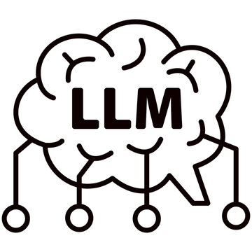

- LLM and AI - 
- Android App Analysis - 
- Software Development - 
- Digital Hardware Design - 
- Digital Communications - 

***

 &nbsp;&nbsp;
**Khaled Ahmed**, Jialing Song, Boqi Chen, Ou Wei, Bingzhou Zheng. MCeT: Behavioral Model Correctness Evaluation using Large Language Models. ACM / IEEE 28th International Conference on Model Driven Engineering Languages and Systems (MODELS), 2025 (25% acceptance rate).

 &nbsp;&nbsp;
**Khaled Ahmed**, Yingying Wang, Mieszko Lis, and Julia Rubin. ViaLin: Path-Aware Dynamic Taint Analysis for Android. The ACM Joint European Software Engineering Conference and Symposium on the Foundations of Software Engineering (FSE), 2023 (26% acceptance rate).

 &nbsp;&nbsp;
Sahar Badihi, **Khaled Ahmed**, Yi Li, and Julia Rubin. Responsibility in Context: On Applicability of Slicing in Semantic Regression Analysis. The 45th IEEE/ACM International Conference on Software Engineering (ICSE), 2023 (26% acceptance rate).

 &nbsp;&nbsp;
Michael Cao\*, **Khaled Ahmed\***, and Julia Rubin. Spoiled Apples Ruin the Bunch: Anatomy of Google Play Malware. The 44th ACM/IEEE International Conference on Software Engineering (ICSE), 2022 (26% acceptance rate) **\*Equal Contribution**

 &nbsp;&nbsp;
**Khaled Ahmed**, Mieszko Lis, and Julia Rubin. [Slicer4J: A Dynamic Slicer For Java.](https://people.ece.ubc.ca/mjulia/publications/Slicer4J_2021.pdf) ACM Joint European Software Engineering Conference and Symposium on the Foundations of Software Engineering (ESEC/FSE), tools track, 2021 <[Code](https://github.com/resess/Slicer4J), [Video](https://youtu.be/mn7z6I-WyH4)>

 &nbsp;&nbsp;
**Khaled Ahmed**, Mieszko Lis, and Julia Rubin. [MANDOLINE: Dynamic Slicing of Android Applications with Trace-Based Alias Analysis.](https://www.ece.ubc.ca/~mjulia/publications/Mandoline_2021.pdf) IEEE International Conference on Software Testing, Verification and Validation (ICST), **Distinguished Paper Award**, 2021 (28% acceptance rate) <[Code](https://github.com/resess/Mandoline), [Slides](../files/ICST_flat_animation.pdf), [Video](https://www.youtube.com/watch?v=hHSEy6EcdsA)>

 &nbsp;&nbsp;
Michael Cao, Sahar Badihi, **Khaled Ahmed**, Peiyu Xiong, and Julia Rubin. [On Benign Features in Malware Detection.](https://www.ece.ubc.ca/~mjulia/publications/On_Benign_Features_in_Malware_Detection_2020.pdf) The 35th IEEE/ACM International Conference on Automated Software Engineering (ASE), short paper, 2020.

 &nbsp;&nbsp;
**Khaled E Ahmed**, Mohamed R Rizk, Mohammed M Farag, "Overloaded CDMA Crossbar For Network-on-Chip", IEEE Transactions on Very Large Scale Integration (VLSI) Systems, 2017

 &nbsp;&nbsp;
Mahmoud A Elmohr, Mostafa A Saleh, Ahmed S Eissa, **Khaled E Ahmed**, Mohammed M Farag, "Hardware Implementation of a SHA-3 Application-Specific Instruction Set Processor." The 28th International Conference on Microelectronics (ICM), 2016.

 &nbsp;&nbsp;
**Khaled E Ahmed**, Mohamed R Rizk, Mohammed M Farag, "Aggregated CDMA Crossbar For Network-on-Chip.", The 28th International Conference on Microelectronics (ICM), 2016

 &nbsp;&nbsp;
**Khaled E Ahmed**, Kareem M Attiah, Ahmed S Eltrass, "Multiple Signal Classification Algorithm Compensated by Extended Kalman Particle Filtering for Wi-Fi Through Wall Multi-Target Tracking." The IEEE-APS Topical Conference on Antennas and Propagation in Wireless Communications (APWC), 2016

 &nbsp;&nbsp;
Ahmed S Eissa, Mahmoud A Elmohr, Mostafa A Saleh, **Khaled E Ahmed**, Mohammed M Farag, "SHA-3 Instruction Set Extension for A 32-bit RISC Processor Architecture." The IEEE 27th International Conference on Application-specific Systems, Architectures and Processors (ASAP), 2016

 &nbsp;&nbsp;
Mostafa Medra, **Khaled E Ahmed**, Timothy N Davidson, "MOSIC: A New Ordering for OSIC MIMO Detection", IEEE 17th International Workshop on Signal Processing Advances in Wireless Communications (SPAWC), 2016

 &nbsp;&nbsp;
**Khaled E Ahmed**, Mohamed R Rizk, Mohammed M Farag, "Overloaded CDMA Interconnect for Network-on-Chip (OCNoC)." The International Conference on ReConFigurable Computing and FPGAs (ReConFig), 2016

 &nbsp;&nbsp;
**Khaled E Ahmed**, Mohammed M Farag, "Parallel Overloaded CDMA Interconnect (OCI) Bus Architecture For On-Chip Communications." The IEEE International Conference on Electronics, Circuits, and Systems (ICECS), 2015

 &nbsp;&nbsp;
**Khaled E Ahmed**, Mohammed M Farag, "Hardware/Software Co-Design of a Dynamically Configurable SHA-3 System-on-Chip (SoC)."
The IEEE International Conference on Electronics, Circuits, and Systems (ICECS), 2015

 &nbsp;&nbsp;
**Khaled E Ahmed**, Mohammed M Farag, "Enhanced Overloaded CDMA Interconnect (OCI) Bus Architecture For On-Chip Communication."
The IEEE 23rd Annual Symposium on High-Performance Interconnects, 2015

 &nbsp;&nbsp;
**Khaled E Ahmed**, Mohammed M Farag, "Overloaded CDMA Bus Topology For MPSoC Interconnect." The International Conference on ReConFigurable Computing and FPGAs (ReConFig), 2014